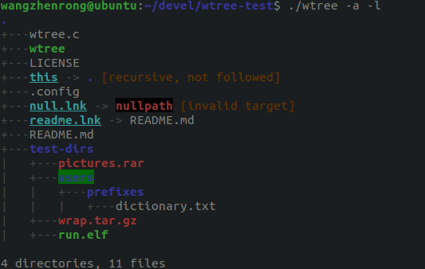

# **wtree: An minimal implementation of the utility `tree` for Unix-like OS**

# **1. About this software**

`tree` is a utility widely used to get the whole structure of a directory. This project `wtree` is a minimal implementation of `tree` from scratch. Similar to the `tree`, `wtree` get and print the directory structure in rich formats (highlights, colors, alignments, etc.).

A typical running of `wtree` as shown below:

# **2. How-to: build and run**

**Step 1:** Clone this repository with command:

`git clone https://github.com/zhenrong-wang/wtree`

**Step 2:** Compile the source code with a C compiler.

`cd wtree`

`gcc -Wall -O3 wtree.c -o wtree`

**Step 3:** Run the binary. NOTE: Default path is the current directory.

`./wtree -a -l` No path provided, use the current directory.

`./wtree -a ~/Pictures`

`./wtree -l /usr/share/`

# **3. Options and outputs**

## **3.1 Options**

Currently there are 2 options: `-a` and `-l`. 

- `-a` : Show all the files/dirs, including the hidden ones.
- `-l` : Follow symbolic links like directories.

By default, the hidden files or dirs would not be printed out, and the symbloc links are not followed.

## **3.2 Outputs**

The outputs would be well formatted.

- Regular files: no special format
- Symbolic links: underlined, bold cyan font
- Regular directories: bold blue font
- Zipped files: bold red font
- Directories with 777 mod: green background, bold blue font
- Executable files: bold green font
- Warn information: grey yellow font
- Corrupted symblic links: black background, bold red font

# **4. Contributing

This software is open source, under the MIT license terms. Please check the `LICENSE` for details.

Any bugs or issues found, please submit or report to this repository.